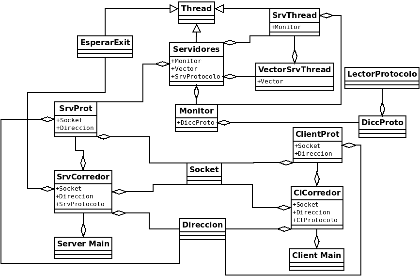

# TP3

## Nombre y Apellido: Axel Aparicio Rotermund
## Padron: 96283
## Link Github: https://github.com/axlrott/TP3-2C-2020.git

### Clases En Comun:

#### Socket:

Esta clase va a representar un socket y va a tener todas sus funciones, en donde sea necesario se va a pedir que se le pase como parametro un puntero a un **struct addrinfo** con el que se creo el socket para utilizarlo, cuando se crea se va a iterar hasta encontrar la direccion en la que sea creado con exito, lo mismo con connect donde se iterara hasta encontrar una direccion en la cual se cree y se conecte con exito.
En caso de que haya algun error en alguna funcion se lanzara la excepcion **ExceptSocket**, menos en ***accept()*** donde se lanzara la excepcion **ExceptSocketAccept**.

#### Direccion:

Esta clase va a ser una representacion de un puntero de **struct addrinfo** el cual se va a crear pasandole el host, el puerto y el flag correspondiente, va a tener una funcion ***get()*** en la cual se devolvera el puntero y el destructor va a tomar el puntero y le va a hacer un ***freeaddrinfo()*** para liberar la memoria.

#### Thread:

Esta clase de Thread esta hecha para ser la clase padre de las que yo quiera que se utilicen los threads, la misma se va a ejecutar utilizando la funcion ***start()*** lo cual va a crear el thread con la funcion ***run()*** de la clase que herede a esta.

### Clases de Cliente:

#### Main:

Esta clase va a tomar el host y el puerto pasado por parametro, va a crear la clase **Client Corredor** y luego va a llamar a este con los parametros, al finalizar se retornara un 0. En caso de que atrape una excepcion del tipo **std::exception** se mostrara por pantalla el mensaje de error y se retornara un 1, en caso de que atrape otro tipo de error se informara que hubo un error desconocido y tambien se retornara 1.

#### Client Corredor:

Esta clase va a recibir un host y un puerto con los que creara una clase **Direccion** y usara esta para crear una clase **Socket** y luego va a utilizar ese **Socket** y esa **Direccion** para crear un **Cliente Protocolo**, el cual luego se llamara como funcion. En caso de que atrape una excepcion del tipo **std::exception** se mostrara por pantalla el mensaje de error y se retornara un 1, en caso de que atrape otro tipo de error se informara que hubo un error desconocido y tambien se retornara 1.

#### Client Protocolo:

Esta funcion va a servir para conectar el socket y enviar el protocolo HTTP a traves de ese socket y luego recibir tambien a traves del socket la respuesta al protocolo enviado e imprimirla por pantalla, privadamente va a estar separada en funciones ***conectar()***, ***recibir()*** y ***enviar()***, y publicamente solo se podra usar esta clase como funcion, lo cual va a llamar a esas 3 funciones en el orden adecuado.

### Clases de Servidor:

#### Main

Esta clase va a tomar el puerto y el nombre del archivo pasados por parametro, va a crear la clase **Server Corredor** y la va a llamar con el puerto y el nombre del archivo, al finalizar esto se retornara un 0. En caso de que atrape una excepcion del tipo **std::exception** se mostrara por pantalla el mensaje de error y se retornara un 1, en caso de que atrape otro tipo de error se informara que hubo un error desconocido y tambien se retornara 1.

#### Server Corredor:

Esta clase va a crear una **Direccion**, luego un **Socket** con esa **Direccion**, luego un **Server Protocolo** con la **Direccion**, el **Socket** y el nombre del archivo pasado por parametro, va a llamar a la funcion para inicializar ese **Server Protocolo** y luego va a crear dos threads: **EsperarExit** y **Servidores**, a este ultimo le pasara el **Server Protocolo** como parametro, luego se hara un ***start()*** de ambos threads, se hara un ***join()*** de EsperarExit y cuando este finalice se hara un ***shutdown()*** de el **Socket** y luego se procedera a hacer un ***join()*** de **Servidores**, luego se eliminaran **EsperarExit** y **Servidores** para liberar memoria, al finalizar se retornara 0, en caso de algun error se retornara el mensaje de error correspondiente y se retornara un 1;

#### Lector Protocolo:

El **Lector Protocolo** lo que va a hacer al crearse es recibir un string que va a representar al protocolo HTTP completo y lo va a parsear para poder guardar dentro de si mismo toda la informacion util, como la primer linea, el metodo y el recurso al que se llama, y en caso de llamarse al metodo POST se guardara tambien el body. A esta clase se le va a poder pedir la informacion que guardo del protocolo, como la primer linea del protocolo, el metodo, el recurso y el body.

#### Diccionario Protocolo:

Esta clase al crearse va a pedir el nombre de un archivo el cual utilizara como index (lo guardara como el body del "/"),
luego al llamarlo como funcion y pasandole un protocolo HTTP utilizara el **Lector Protocolo** para poder sacar solo la informacion util y vera que hacer en caso de que el metodo sea GET buscara en el diccionario el recurso al que se le hace GET y si lo encuentra devolvera el mensaje correspondiente y el body, en caso de POST tambien devolvera el mensaje correspondiente, en caso de que se llame a otro metodo tambien se devolvera un mensaje correspondiente al llamado de un metodo que no esta permitido.

#### Server Protocolo:

Esta clase va a servir para almacenar un **Socket**, su **Direccion** asociada y el **Diccionario Protocolo**, el cual inicializara con el nombre del archivo pasado por parametro. Va a contener funciones para inicializar y aceptar con el socket contenido y luego funciones que estan para ser utilizadas con el socket que haya sido devuelto al hacer accept, que son recibir, la cual recibe a traves del socket pasado por parametro un parametro HTTP el cual luego lo pasa por el **Diccionario Protocolo** y devuelve la respuesta correspondiente, la cual luego se deberia devolver utilizando la funcion enviar la cual enviara por el socket pasado por parametro el mensaje que se le haya pasado.

#### Esperar Exit:

Esta clase va a heredar de **Thread** y su funcion va a ser constantemente pedir un caracter por entrada estandar y va a finalizar su ejecucion solo cuando se le haya ingresado el caracter "q".

#### Servidores:

Esta es una clase que hereda de **Thread** y la funcion que va a tener es crear **Servidores Threads**, almacenarlos en el **Vector de Servidores Threads** y luego realizar la limpieza del mismo para ir liberando memoria si algun **Servidor Thread** ya termino su ejecucion. Esto se hara constantemente hasta que de parte del **Servidor Thread** se lance una **ExceptionSocketAccept**, a la cual se le hara un catch y se limpiara todo el **Vector de Servidores Threads** para liberar memoria y se finalizara la ejecucion.

#### Monitor:

La clase monitor va a recibir un **Server Protocolo** y su funcion va a hacer es ejecutar las funciones ***enviar()*** y ***recibir()*** utilizando un mutex para evitar alguna race condition.

#### Servidores Threads:

Esta clase va recibir un monitor y un socket al ser creada y seteara su funcion is_alive como true. Va a guardar el socket recibido al hacer el ***accept()*** del socket que recibio por parametro y mediante el monitor va a recibir con el socket guardado y luego va a enviar mediante el monitor a traves del socket lo que habia recibido anteriormente, al finalizar esto dejara su valor de is_alive como false.

#### Vector de Servidores Threads:

Esta clase contiene un vector de punteros a **Servidores Threads** al cual le puedo agregar un nuevo puntero, puedo hacer una revision en la cual si un **Servidor Thread** ya termino de correr puedo hacer su respectivo ***join()*** y liberar su memoria y por ultimo tambien tengo una funcion donde limpio todo el vector haciendo sus respectivos ***join()*** y liberando la memoria de todo lo que haya en el vector.

### Excepciones:

Las excepciones que cree van a recibir el nombre de la funcion en la que se genero el error y luego van a crear el mensaje de error en base a el nombre de la funcion, la clase en la que sucedio el error y el codigo de error.
Las excepciones creadas son **ExceptionSocket**, **ExceptionSocketAccept** (La cual hereda de **ExceptionSocket**) y **ExceptionDireccion**,
la clase **ExceptionSocketAccept** fue hecha a parte ya que quiero diferenciarla asi la puedo atrapar en la clase **Servidores** y asi poder salir correctamente, ya que este error seria uno que yo estoy generando al cerrar el socket por fuera del thread.

### Diagrama:

